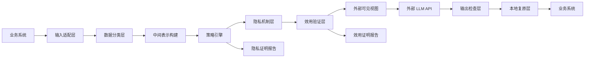

# 架构设计

## 目标

脱敏网关是一个本地可信控制平面，位于业务系统和外部大模型 API 之间。它负责把原始复杂数据转换为外部可见视图，并证明该视图满足隐私约束和任务效用约束。

## 总体数据流



## 信任边界

可信边界内：

- 原始数据。
- 本地密钥。
- token 映射表。
- 策略配置。
- 结构化中间表示。
- 证明报告生成过程。

可信边界外：

- 外部 LLM API。
- 外部 API 日志和缓存。
- 第三方工具调用结果。
- 外部向量库或远程存储。

默认设计要求外部侧只能看到外部可见视图，不能看到原文、本地密钥或映射表。

## 主要组件

### 输入适配层

负责接收和解析输入：

- 文本。
- JSON。
- CSV。
- 多表数据。
- RAG 文档片段。
- 未来扩展 PDF、OCR 和图像文本。

输入适配层不直接调用外部模型，而是先将数据交给中间表示构建层。

### 数据分类层

识别数据中的字段类型、敏感等级和任务意图：

- 直接标识符。
- 准标识符。
- 敏感属性。
- 业务实体。
- 关系边。
- 统计查询。

本层可以使用规则、字典、本地模型和人工标注策略，但数学保证只建立在确定性机制和验证结果之上。

### 中间表示构建

复杂数据被转换为 typed entity-relation graph：

```text
Entity(id, type, attributes)
Relation(source, predicate, target)
Constraint(expression)
TaskProfile(name, required_fields, utility_bounds)
```

该表示用于统一处理文本、表格和多表关系。

### 策略引擎

根据数据类型和任务画像选择机制：

- HMAC tokenization。
- 随机 tokenization。
- 格式保持加密。
- 泛化。
- 抑制。
- 差分隐私。
- 本地处理。
- 阻断外发。

策略必须是确定性的、版本化的、可审计的。

### 隐私机制层

执行具体隐私保护：

- 对直接标识符执行 tokenization。
- 对准标识符执行泛化、分桶或抑制。
- 对统计查询执行差分隐私机制。
- 对高敏字段执行本地保留或阻断。

该层输出外部可见视图和隐私证明报告。

### 效用验证层

验证脱敏后数据是否仍满足任务要求：

- 实体类型保持。
- 关系保持。
- 外键完整。
- 时间顺序保持。
- 金额和数量约束保持。
- 统计误差满足边界。
- 下游任务画像的必要字段仍存在。

该层输出效用证明报告。

### 输出检查层

外部模型返回后，输出检查层验证：

- 是否出现原始敏感字段。
- 是否出现未授权推断。
- 是否违反任务边界。
- 是否破坏结构化输出 schema。
- 是否需要本地复原 token。

输出检查不是隐私数学保证的唯一来源，但可以防止模型响应把风险重新带回业务系统。

## 外部可见视图

外部可见视图是唯一允许发送给外部 API 的数据。它应满足：

- 不包含原始直接标识符。
- 不包含本地密钥或映射表。
- 不包含未授权字段。
- 保留任务所需的最小信息。
- 可通过 hash 与证明报告绑定。

## 运行模式

### 文本代理模式

适用于客服、合同、邮件、工单等文本任务。网关将文本转换为实体和关系，再生成占位符化文本。

### 结构化数据模式

适用于 CSV、JSON、多表业务数据。网关直接对字段和关系执行策略，并验证结构约束。

### 统计查询模式

适用于汇总分析。网关不外发行级数据，只返回满足差分隐私的统计结果或摘要上下文。

### RAG 模式

文档入库前先脱敏，检索后再次检查，最终 prompt 进入外部模型前再生成证明报告。

## 设计约束

- 任何外部调用必须绑定一次策略版本。
- 任何外部调用必须绑定外部可见视图 hash。
- 直接标识符的映射表不得离开本地。
- 差分隐私预算必须可累计。
- 复杂数据集必须先结构化，再脱敏。
- 自由文本只能获得条件性保证，不能获得无条件完备保证。

