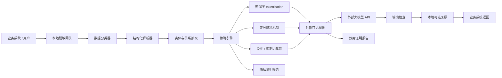

# ProofGate 白皮书

## 摘要

企业在使用外部大模型 API 时，常面临一个核心矛盾：外部模型具有更强的推理、生成和工具调用能力，但业务输入中可能包含个人信息、商业秘密、医疗金融数据、源代码、日志和其他受监管数据。传统做法通常依赖关键词过滤、正则表达式、命名实体识别或人工审查，但这些方法难以在复杂数据集、跨表关系、自由文本和 Agent 工具链中提供可验证保证。

本项目提出一个本地部署的脱敏网关：在数据离开企业边界前，对输入进行分类、投影、加密、tokenization、差分隐私处理和结构约束验证；在外部模型返回后，再进行输出检查、可选复原和审计归档。项目目标不是追求“模型声称已脱敏”，而是构建一个可以输出隐私证明报告和效用证明报告的系统，使用户能够验证：

1. 敏感信息在明确威胁模型下不可被恢复或重识别。
2. 脱敏后的数据在明确任务集合下仍保持足够的信息有效性。

## 问题定义

### 背景

混合模型部署正在成为企业 AI 落地中的重要模式：

- 本地模型和本地规则系统负责数据分类、隐私保护、审计和策略执行。
- 外部大模型 API 负责摘要、推理、问答、代码生成、报告撰写和复杂任务编排。

这种模式的价值在于降低敏感数据暴露面，同时利用外部模型能力。但如果脱敏层不可验证，它会变成一个新的风险源：企业以为数据已经安全，实际上敏感信息可能通过漏检、上下文暗示、准标识符组合、日志、缓存、向量索引或工具调用泄露。

### 核心问题

本项目聚焦两个可验证问题：

**隐私有效性**

给定原始数据集 `D`、脱敏机制 `M` 和外部可见视图 `V = M(D)`，攻击者在不知道本地密钥和本地映射表的情况下，是否能够恢复直接标识符、推断敏感属性或重识别个体？

**信息有效性**

给定任务集合 `F`，脱敏后视图 `V` 是否仍能支持后续主数据处理流程，并满足结构、关系、统计和业务约束？

这两个目标天然存在张力。若某个任务本身要求输出身份信息，则不可能同时保证身份隐私和任务完整性。因此本项目采用明确的隐私-效用权衡，而不是承诺无条件的完美保护。

## 设计原则

### 1. 威胁模型先行

所有保证必须绑定威胁模型。默认威胁模型为：

- 外部 API 可看到脱敏后的 prompt、上下文、工具结果和模型输出。
- 外部 API 不可访问本地密钥、本地 token 映射表和原始数据。
- 攻击者可能拥有部分公开外部数据，并尝试进行链接攻击。
- 攻击者可能通过 prompt injection、上下文推断、频率分析和多轮对话诱导泄露。
- 本地网关、密钥管理系统和策略引擎被视为可信计算边界。

非默认威胁模型包括本地环境被攻破、密钥泄露、恶意内部人员、外部 API 与公开数据大规模合谋等。这些场景需要额外的访问控制、硬件隔离、密钥轮换和组织治理。

### 2. 机制优先于模型判断

自然语言模型可以参与识别和分类，但数学保证不应建立在“模型判断正确”之上。可证明保护应优先来自：

- 加密。
- HMAC tokenization。
- 格式保持加密。
- 差分隐私机制。
- 结构化投影。
- 形式化约束验证。

模型适合处理模糊上下文，但不适合作为唯一的隐私边界。

### 3. 任务集合显式化

信息有效性不能抽象承诺，必须绑定具体任务集合，例如：

- 客服工单分类。
- 合同风险摘要。
- 订单异常分析。
- 医疗记录结构化抽取。
- 安全日志聚类。
- RAG 问答。
- Agent 工具调用规划。

不同任务需要不同脱敏强度。摘要任务可以强脱敏，法律分析可能需要保留角色关系，统计分析则更适合差分隐私聚合。

### 4. 可验证证明输出

每次处理应生成机器可读证明报告：

- 隐私证明报告：说明使用了哪些保护机制、密钥域、隐私预算、残留风险和外部可见字段。
- 效用证明报告：说明保留了哪些实体类型、关系、约束、统计误差和任务可用性边界。

证明报告不是外部背书，而是由机制、参数、约束和验证结果组成的可复算事实记录。

## 系统架构



### 本地脱敏网关

网关是所有模型请求的强制入口，负责：

- 接收输入数据和任务意图。
- 识别数据类型、敏感等级和下游任务。
- 将自由文本、表格、JSON、PDF、OCR 结果统一转换为中间表示。
- 根据策略选择脱敏机制。
- 生成外部可见视图。
- 调用外部模型。
- 检查输出并执行本地复原。
- 生成审计记录和证明报告。

### 中间表示

复杂数据集不应直接按字符串处理。本项目采用 typed entity-relation graph 作为中间表示：

```text
Entity:
  id: local stable id
  type: PERSON | ORG | ORDER | CONTRACT | DEVICE | LOCATION | ...
  attributes: typed key-value fields

Relation:
  source: entity id
  predicate: owns | signs | pays | reports_to | located_in | ...
  target: entity id

Constraint:
  expression: foreign key, time order, sum consistency, state transition
```

这种表示允许系统同时处理文本语义、表结构、图关系和业务约束。

## 数学保证

### 直接标识符保护

对姓名、手机号、身份证号、邮箱、客户号、银行卡号、设备 ID 等直接标识符，网关使用确定性 tokenization：

```text
token = HMAC_K(type || canonical(value))
```

其中：

- `K` 为本地密钥。
- `type` 为实体或字段类型。
- `canonical(value)` 为规范化后的原始值。

在 HMAC 安全假设下，外部 API 不知道 `K` 时无法从 token 反推出原始值。确定性 tokenization 保留相等关系：

```text
value_a = value_b  =>  token_a = token_b
```

这支持跨文档一致性，但会泄露重复频率。若任务不需要一致性，可使用随机 token：

```text
token = random_id(type)
```

随机 token 降低频率泄露，但会牺牲跨记录关联能力。

### 准标识符保护

对年龄、地区、职业、日期、金额、疾病、学校、机构、岗位等准标识符，应根据任务选择泛化、抑制或差分隐私。

对于统计查询，采用差分隐私定义：

```text
Pr[M(D) in S] <= exp(epsilon) * Pr[M(D') in S] + delta
```

其中 `D` 和 `D'` 是只相差一条记录的相邻数据集。该定义保证单个个体是否存在于数据集中，对外部结果的影响被 `epsilon` 和 `delta` 限制。

例如计数查询 `f(D)` 的全局敏感度为 1，可使用 Laplace 机制：

```text
M(D) = f(D) + Laplace(1 / epsilon)
```

对应误差界为：

```text
Pr[abs(M(D) - f(D)) > a] = exp(-a * epsilon)
```

给定失败概率 `beta`：

```text
abs(M(D) - f(D)) <= ln(1 / beta) / epsilon
```

这使统计效用可以被验证。

### 结构保真

对复杂数据集，信息有效性以结构保真方式定义。设原始图为 `G = (E, R)`，脱敏映射为 `T`。若原始图中存在关系：

```text
(u, predicate, v) in R
```

脱敏后必须存在：

```text
(T(u), predicate, T(v)) in T(R)
```

即：

```text
forall r in R, preserve(r, T(r)) = true
```

这种约束保证角色、引用、业务链路和事件顺序不会被脱敏过程破坏。

### 任务效用边界

给定任务集合 `F` 和损失函数 `loss`，效用目标定义为：

```text
forall f in F:
  loss(f(M(D)), f(D)) <= alpha_f
```

对于不同任务，`alpha_f` 可表示为：

- 分类准确率下降不超过阈值。
- 摘要事实一致性下降不超过阈值。
- 抽取字段 F1 下降不超过阈值。
- SQL 查询结果误差不超过阈值。
- 图关系保持率不低于阈值。
- 统计估计误差在置信区间内。

该目标通常需要通过基准集、合成数据、金标任务和回归测试验证，而不是单靠形式证明。

## 脱敏策略

### 字段类型策略

| 数据类型 | 推荐机制 | 隐私保证 | 效用影响 |
|---|---|---|---|
| 身份证号 | HMAC token 或 FPE | 密钥未知时不可逆 | 可保留相等性和格式 |
| 手机号 | HMAC token 或部分泛化 | 不泄露原值 | 可保留地区段或运营商信息 |
| 姓名 | typed tokenization | 不泄露原名 | 保留人物区分和关系 |
| 地址 | 层级泛化 | 降低重识别 | 保留区域分析能力 |
| 日期 | 粒度泛化或相对时间 | 降低链接攻击 | 保留顺序和周期 |
| 金额 | 分桶或 DP 噪声 | 降低精确推断 | 保留统计趋势 |
| 罕见疾病 | 泛化或本地处理 | 降低敏感属性泄露 | 可能明显损害任务 |
| 合同编号 | deterministic token | 不泄露原编号 | 保留跨表关联 |
| API key | 删除或不可逆 hash | 防凭据泄露 | 通常不影响任务 |

### 任务类型策略

| 任务 | 策略 |
|---|---|
| 文档摘要 | 直接标识符 tokenization，准标识符泛化 |
| 合同审查 | 保留实体角色、组织类型、金额区间和时间顺序 |
| 客服回复 | tokenization 后外部生成，返回前本地复原必要字段 |
| 统计分析 | 差分隐私聚合，不发送行级数据 |
| 医疗文本处理 | 高敏字段本地处理，外部仅看最小必要上下文 |
| 安全日志分析 | 主机、账号、IP tokenization，保留拓扑关系 |
| RAG | 入库前脱敏，检索后复检，引用输出再审查 |
| Agent | 工具输入输出全部经过策略引擎，禁止绕过网关 |

## 复杂数据集处理

复杂数据集的难点在于敏感性不只存在于单个字段，而存在于组合、关系和外部可链接信息中。

### 跨表一致性

如果客户表、订单表、合同表和工单表都引用同一客户，脱敏后必须使用同一 token：

```text
raw.customer_id = "C12345"
T(raw.customer_id) = "<CUSTOMER_7>"
```

所有外键引用必须同步替换，否则下游模型无法理解业务关系。

### 时间保真

绝对时间可能泄露身份，但事件顺序通常对任务有效性关键。可将绝对时间转换为相对时间：

```text
2026-04-01 09:12 -> T0
2026-04-03 15:30 -> T0 + 2d6h18m
```

这样保留事件间隔和顺序，同时减少链接攻击风险。

### 地理层级泛化

地址可按任务需要保留不同粒度：

```text
门牌号 -> 小区 -> 街道 -> 区县 -> 城市 -> 省份
```

对低风险任务保留城市即可；对物流异常分析可能需要区县；对具体上门服务则必须在本地完成，不应交给外部模型。

### 关系保护

自然语言中的关系需要转为显式结构：

```text
原文：张三是李四的担保人，李四负责北京分公司的采购。

实体：
  PERSON_1
  PERSON_2
  ORG_BRANCH_1

关系：
  PERSON_1 --guarantees--> PERSON_2
  PERSON_2 --responsible_for--> ORG_BRANCH_1
```

外部模型可基于关系完成分析，但不能看到真实身份。

## 可验证证明报告

### 隐私证明报告

网关每次处理生成隐私证明报告：

```json
{
  "report_type": "privacy_proof",
  "policy_version": "2026.05.03",
  "input_digest": "sha256:...",
  "external_view_digest": "sha256:...",
  "mechanisms": [
    {
      "field_type": "PERSON",
      "mechanism": "HMAC_TOKENIZATION",
      "key_domain": "local-kms/person/v1",
      "leakage": ["equality", "frequency"]
    },
    {
      "field_type": "COUNT_STATISTIC",
      "mechanism": "LAPLACE_DP",
      "epsilon": 0.5,
      "delta": 0
    }
  ],
  "residual_risks": [
    "external_linkage_attack_on_generalized_location",
    "frequency_analysis_on_deterministic_tokens"
  ]
}
```

### 效用证明报告

效用证明报告记录脱敏后信息是否仍满足任务要求：

```json
{
  "report_type": "utility_proof",
  "task_profile": "contract_risk_review",
  "entity_type_preservation": 1.0,
  "relation_preservation": 1.0,
  "foreign_key_validity": 1.0,
  "time_order_validity": 1.0,
  "constraint_violations": 0,
  "statistical_error_bounds": [
    {
      "query": "monthly_count",
      "epsilon": 0.5,
      "beta": 0.01,
      "absolute_error_bound": 9.21
    }
  ]
}
```

证明报告应可被审计系统、CI 流水线、安全平台或合规平台消费，并可被独立复算。

## 验证方法

### 隐私验证

隐私验证包括：

- 检查外部视图中是否存在原始直接标识符。
- 验证 token 是否由指定密钥域生成。
- 计算准标识符组合唯一率。
- 对统计输出验证差分隐私预算。
- 对文本输出再次运行独立检测器。
- 对向量库、缓存、日志和 trace 检查原文残留。
- 构造链接攻击测试集，评估重识别率。

### 效用验证

效用验证包括：

- 外键完整性检查。
- 图关系保持率检查。
- 时间顺序检查。
- 数值约束检查。
- 业务状态机检查。
- 下游任务回归测试。
- 脱敏前后分布差异检查。
- 任务输出人工抽样审查。

### 反例验证

系统应主动生成反例：

- 罕见职业 + 小城市 + 精确日期。
- 中文姓名缩写、拼音、谐音、错别字。
- OCR 错识别身份证号。
- 多轮对话中逐步拼接身份。
- RAG 文档片段跨片段重识别。
- Agent 工具返回未脱敏字段。

反例测试是网关安全性的核心组成部分。

## 项目范围

### 第一阶段

第一阶段目标是建立最小可验证原型：

- 定义中间表示。
- 实现规则和字段级 tokenization。
- 实现本地映射表。
- 实现基础结构约束验证。
- 输出隐私证明报告和效用证明报告。
- 支持文本、JSON 和 CSV 输入。
- 支持外部 LLM API 代理调用。

### 第二阶段

第二阶段扩展复杂数据集：

- 支持多表关系。
- 支持 RAG 入库前脱敏。
- 支持 OCR 文档。
- 支持中文地址层级泛化。
- 支持差分隐私统计查询。
- 支持任务级效用评估。

### 第三阶段

第三阶段形成企业可用网关：

- 策略 DSL。
- 密钥轮换。
- 多租户隔离。
- 审计后台。
- CI 测试集。
- 合规报告导出。
- 与 DLP、SIEM、IAM、KMS 集成。

## 非目标

本项目不承诺：

- 对任意自由文本提供绝对隐私保证。
- 在不定义任务集合的情况下保证脱敏后仍然有效。
- 替代数据治理、访问控制和法律合规审查。
- 在本地密钥泄露后继续保持 token 不可逆。
- 对所有外部世界知识链接攻击提供无条件防护。

## 研究假设

本项目基于以下研究假设：

1. 企业数据脱敏网关必须从文本过滤升级为结构化投影系统。
2. 对直接标识符，密码学机制比模型识别更适合作为隐私边界。
3. 对统计分析任务，差分隐私比传统字段遮蔽更容易给出可证明误差界。
4. 对复杂业务数据，实体关系保真比原始文本保真更重要。
5. 可验证证明报告会成为企业混合部署大模型的核心治理接口。

## 结论

脱敏网关的核心价值不是简单隐藏敏感词，而是在本地可信边界内构建一个可证明、可验证、可审计的数据投影层。它将原始复杂数据转换为外部模型可处理的安全视图，并明确记录隐私损失和效用边界。

本白皮书定义的路线强调三点：

1. 用密码学和差分隐私提供数学隐私保证。
2. 用结构化中间表示和约束验证保证脱敏后的信息有效性。
3. 用隐私证明报告和效用证明报告让每次外部模型调用可审计、可复现、可验证。

这使混合部署模型从经验性安全实践，进一步走向可度量的工程系统。
